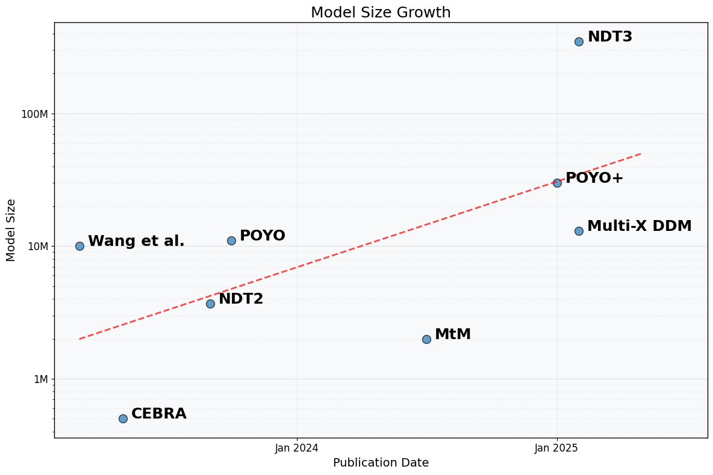
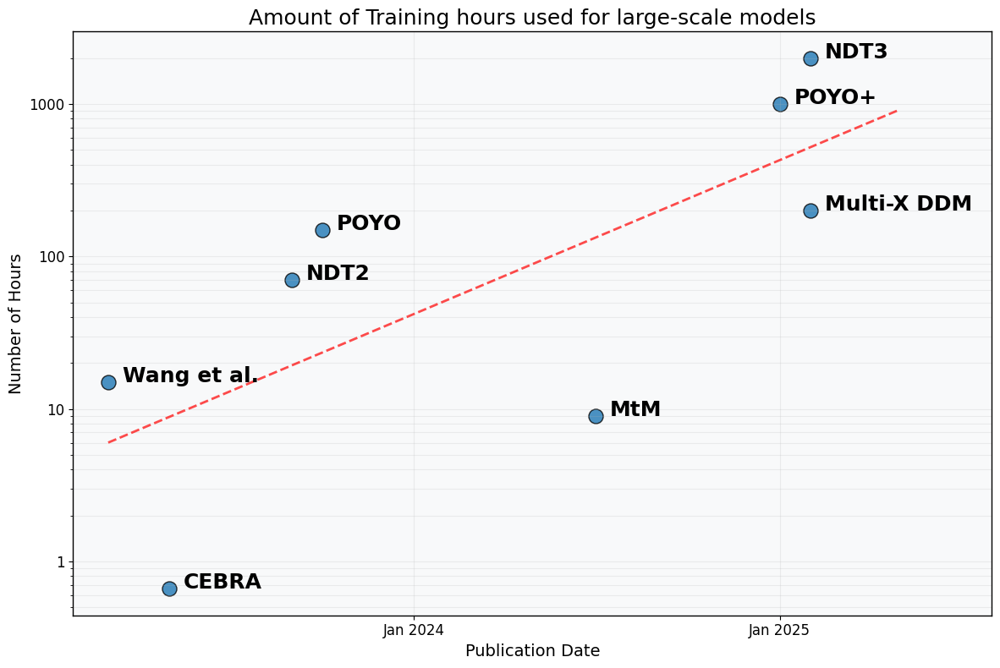

# Awesome Neuro-Foundation Models 

A curated list of foundation models for neural population activity. This repository compiles state-of-the-art models for analyzing, decoding, and predicting neural activity across different species, brain regions, and modalities.

This repository is a work in progress and will be updated regularly. Current models are limited to 
EPhys and OPhys modalities. This is by no means a comprehensive list of all models.

If you have any suggestions or want to contribute, **please open
an issue or submit a pull request**. 

### Large-scale multi-animal models

- **POYO**: A Unified, Scalable Framework for Neural Population Decoding. NeurIPS 2023 [[paper](https://arxiv.org/abs/2310.16046)] [[project page](https://poyo-brain.github.io/)]

- **POYO+**: Multi-session, multi-task neural decoding from distinct cell-types and brain regions. ICLR 2025 [[paper](https://openreview.net/forum?id=IuU0wcO0mo)]

- **NDT2**: Neural Data Transformer 2: Multi-context Pretraining for Neural Spiking Activity. NeurIPS 2023 [[paper](https://proceedings.neurips.cc/paper_files/paper/2023)] [[code](https://github.com/joel99/context_general_bci)]

- **MtM**: Towards a "universal translator" for neural dynamics at single-cell, single-spike resolution. NeurIPS 2024 [[paper](https://openreview.net/forum?id=CBBtMnlTGq)] [[project page](https://ibl-mtm.github.io/)]

- **NDT3**: A Generalist Intracortical Motor Decoder. Preprint, 2025 [[paper](https://www.biorxiv.org/content/10.1101/2025.02.02.634313v1)] [[project page](https://github.com/joel99/ndt3)]

- **Multi-X DDM**: One Model to Train Them All: A Unified Diffusion Framework for Multi-Context Neural Population Forecasting. Preprint, 2025 [[paper](https://openreview.net/forum?id=R9feGbYRG7)]

- **Wang et al.**: Towards a Foundation Model of the Mouse Visual Cortex. Preprint, 2023 [[paper](https://www.biorxiv.org/content/10.1101/2023.03.21.533548v1)]

- **CEBRA**: Learnable latent embeddings for joint behavioural and neural analysis. Nature 2023 [[paper](https://www.nature.com/articles/s41586-023-06031-6)] [[project page](https://cebra.ai)]

### Other relevant models

- **Neuroformer**: Neuroformer: Multimodal and Multitask Generative Pretraining for Brain Data, ICLR 2024 [[paper](https://arxiv.org/abs/2311.00136)] [[project page](https://a-antoniades.github.io/Neuroformer_web/)]

- **GNOCCHI**: Diffusion-Based Generation of Neural Activity from Disentangled Latent Codes, Preprint 2024 [[paper](https://arxiv.org/abs/2407.21195)]

- **LDNS**: Latent Diffusion for Neural Spiking Data, NeurIPS 2024 [[paper](https://arxiv.org/abs/2407.08751)] [[code](https://github.com/mackelab/LDNS)]

- **NDT1**: Representation learning for neural population activity with Neural Data Transformers,
NBDT 2021. [[paper](https://arxiv.org/abs/2108.01210)] [[code](https://github.com/snel-repo/neural-data-transformers)]

- **PopT**:Population Transformer: Learning Population-level Representations of Neural Activity, 	ICLR 2025. [[paper](https://arxiv.org/abs/2406.03044)]

### Benchmarks

- **FALCON**: Few-shot Algorithms for Consistent Neural Decoding (FALCON) Benchmark [[paper](https://openreview.net/forum?id=FN02v4nD8y)] [[project page](https://snel-repo.github.io/falcon/)]

### Large-scale datasets and repositories

- Allen Brain Observatory [[website](https://observatory.brain-map.org/visualcoding/)]
- International Brain Laboratory [[website](https://www.internationalbrainlab.com/data)]
- dandi repository [[website](https://www.dandiarchive.org/)]

### Tools

<table>
  <tr>
    <td align="center"> <b>temporaldata</b> Library for handling temporal neural data with efficient data structures and processing tools <a href="https://temporaldata.readthedocs.io/en/latest/index.html">View Documentation</a></td>
    <td align="center"> <b>brainsets</b> A collection of pre-processed neuroscience datasets ready for model training and evaluation <a href="https://brainsets.readthedocs.io/en/latest/index.html">View Documentation</a></td>
    <td align="center"> <b>torch_brain</b> A PyTorch-based library for building transformer models for neuroscience applications <a href="https://torch-brain.readthedocs.io/en/latest/index.html">View Documentation</a></td>
  </tr>
</table>

### Other resources:
- The NeuroAI archive [[website](https://www.neuroai.science/)]
- COSYNE 2025 workshop "Neuro-Foundation Models" [[website](https://neurofm-workshop.github.io/)]
- COSYNE 2025 tutorial "Transformers in Neuroscience" [[website](https://cosyne-tutorial-2025.github.io/)]

### Scaling trends for neuro-foundation models

